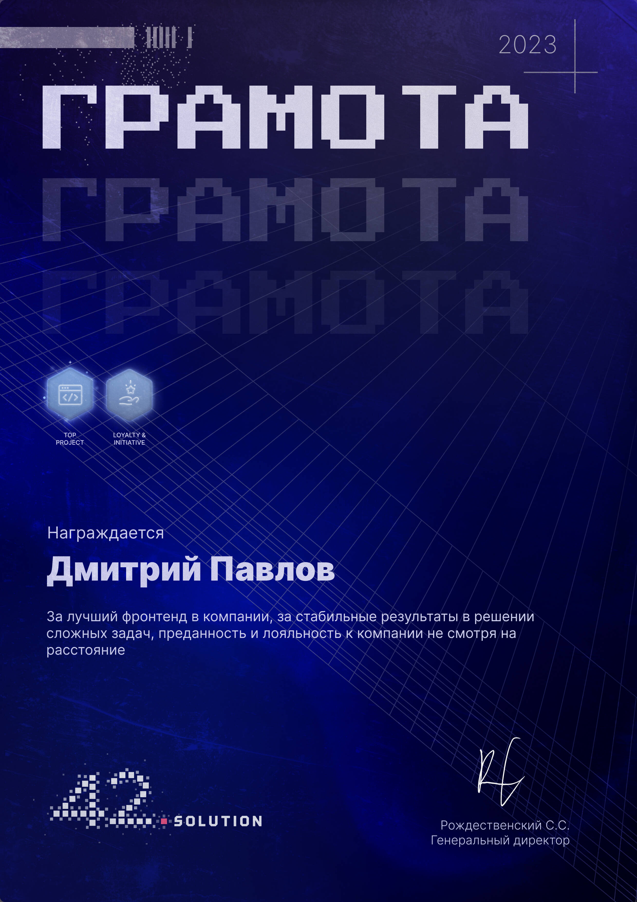

Senior Frontend Engineer with 5 years of experience building production web apps, internal tools, and real-time products using React, Vue, and TypeScript. Strong in architecture, performance, clean systems, and shipping real value fast. Comfortable both in messy legacy and greenfield environments. Deep ownership mindset, sharp problem-solving, zero drama — just engineering.

Daily stack: TypeScript, React, Vue 2/3, Next.js, Vite, Electron, Node/Nest, REST/GraphQL, FSD, performance optimization. Looking for a team that wants builders, not task‑runners.

## 🎸 Featured Projects

## 💼 Experience / 🎓 Education

## 🔥 Skills

    

   

           

     

        

     

## 🏆 Award

  
   
  <i>“For delivering the best frontend in the company, consistently solving complex tasks, and demonstrating loyalty and dedication regardless of distance.” — 42Solution · 2023</i>

<!-- 

|  |  |  |
|---|---|---|
| 
 <i>“For delivering the best frontend in the company, consistently solving complex tasks, and demonstrating loyalty and dedication regardless of distance.” — 42Solution · 2023</i>
 | 
 <i>“For delivering the best frontend in the company, consistently solving complex tasks, and demonstrating loyalty and dedication regardless of distance.” — 42Solution · 2023</i>
 | 
 <i>“For delivering the best frontend in the company, consistently solving complex tasks, and demonstrating loyalty and dedication regardless of distance.” — 42Solution · 2023</i>
 |
| 
 <i>“For delivering the best frontend in the company, consistently solving complex tasks, and demonstrating loyalty and dedication regardless of distance.” — 42Solution · 2023</i>
 | 
 <i>“For delivering the best frontend in the company, consistently solving complex tasks, and demonstrating loyalty and dedication regardless of distance.” — 42Solution · 2023</i>
 | 
 <i>“For delivering the best frontend in the company, consistently solving complex tasks, and demonstrating loyalty and dedication regardless of distance.” — 42Solution · 2023</i>
 |

 -->

<!-- 

|  |  |
|---|---|
| 
 <i>“For delivering the best frontend in the company, consistently solving complex tasks, and demonstrating loyalty and dedication regardless of distance.” — 42Solution · 2023</i>
 | 
 <i>“For delivering the best frontend in the company, consistently solving complex tasks, and demonstrating loyalty and dedication regardless of distance.” — 42Solution · 2023</i>
 |
| 
 <i>“For delivering the best frontend in the company, consistently solving complex tasks, and demonstrating loyalty and dedication regardless of distance.” — 42Solution · 2023</i>
 | 
 <i>“For delivering the best frontend in the company, consistently solving complex tasks, and demonstrating loyalty and dedication regardless of distance.” — 42Solution · 2023</i>
 |
| 
 <i>“For delivering the best frontend in the company, consistently solving complex tasks, and demonstrating loyalty and dedication regardless of distance.” — 42Solution · 2023</i>
 | 
 <i>“For delivering the best frontend in the company, consistently solving complex tasks, and demonstrating loyalty and dedication regardless of distance.” — 42Solution · 2023</i>
 |

 -->

## 📌 Notes

Open to remote (EU/US) and relocation. Engineering mindset → architecture, clarity, speed, maintainability. Built products in: enterprise, healthcare, AI tooling, real‑time streaming.

## 📊 GitHub Stats

  
  <!--  -->
  <!--  -->

  

